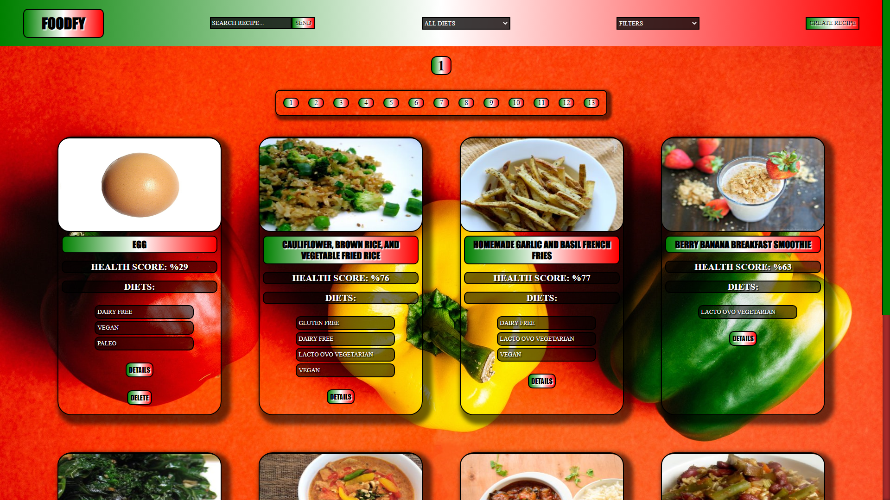

# Foodfy

Podras ejecutar este proyecto con los siguientes comandos en consola en ambas carpetas, `npm install` (instalar dependecias) luego `npm start` (levantar proyecto).  

### Foodfy es mi proyecto individual de comidas saludables para Soy Henry.

### El cual además de mostrar comidas saludables podes crear tu propia receta para que los demás la vean.

### Contiene un gran cantidad de filtros como de dietas, de orden alfabético y de porcentaje saludable.

### Podras ver en detalle cada receta si lo deseas.

### Contas con una barra de busqueda la cual te facilitará el trabajo a la hora de buscar la receta que desees

## Inicio

## Barra de búsqueda, filtros y recetas. 

## Detalle de recetas 

## Creador de recetas

